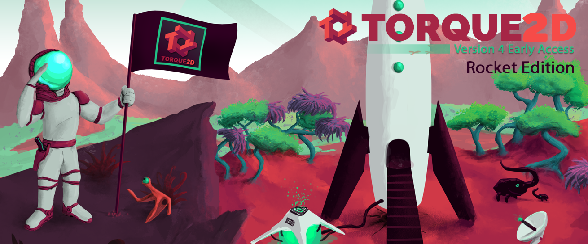

## Torque2D 4.0 Early Access 1

MIT Licensed Open Source version of Torque2D from GarageGames. Maintained by the Torque Game Engines team and contributions from the community.

Dedicated to 2D game development, Torque 2D is an extremely powerful, flexible, and fast C++ engine which has been used in hundreds of professional games. It is a true cross platform solution providing you access to Windows, OSX, Linux, iOS, Android, and the web - all from one codebase. It includes an OpenGL batched rendering system, Box2D physics, OpenAL audio, skeletal and spritesheet animation, automated asset management, a modular project structure, TAML object persistence, and a C-like scripting language.

### What's New?

Torque2D 4.0: Rocket Edition is currently in progress. The major change with 4.0 is the addition of editors! At this time there is a working Asset Manager that allows a user to create, edit, and remove images, animations, particle effects, bitmap fonts, and audio assets. This represents a major step forward from editing xml files by hand. This is especially useful in the case of particle effects which are nearly impossible to create without an interactive tool. Expect additional refinement of this tool over the coming releases.

The Asset Manager can be reached by opening the console using the console button in the Toybox or by pressing Tilde(~) + Ctrl. You will then notice tabs along that top that include the Asset Manager.

You may also notice that we have several toys such as the Gui Editor Toy and Scene Editor Toy that are in-progress versions of future editors. These toys are not very useful yet, but we plan to develop them into full editors in coming releases.

The Rocket Edition also features a revamped Gui System! Until now it has been a common practice among those seriously using T2D to avoid the Gui System as much as possible. We aim to fix that with the Rocket Edition. Explanation of how to use the updated Gui System can be found in the wiki in the [Gui Guide](https://github.com/TorqueGameEngines/Torque2D/wiki/GUI-Guide).

More features and editors are coming before 4.0 is official done, but new projects should make use of the Early Access version to avoid future conflicts.

### Branches

Here is an overview of the branches found in the Torque2D repository:

* **master:** this branch contains the current stable release code that can be used in a production environment.
* **development:** this branch is dedicated to active development. It contains the latest bug fixes, new features, and other updates. All pull requests need to go to the development branch. While we try our best to test all incoming changes, it is possible for mistakes to slip in therefore this branch should always be considered unstable.
* **gh-pages:** this branch currently contains the html pages generated from doxygen for the engine and TorqueScript references.

### Precompiled Version

If you do not wish to compile the source code yourself, precompiled binary files for Windows and OSX are available from the [Torque 2D Release Page](https://github.com/TorqueGameEngines/Torque2D/releases).

### Building the Source

After downloading a copy of the source code, the following project files for each platform are provided for you and can be found in the `engine/compilers` folder.

* **Windows:** Visual Studio 2017 (works with the free Community Edition) and 2019
* **OSX:** Xcode
* **Linux:** Make
* **iOS:** Xcode_iOS
* **Android:** Android Studio
* **Web:** Emscripten/Cmake

See the [wiki](https://github.com/TorqueGameEngines/Torque2D/wiki) for available guides on platform setup and development.

### Batteries Included

Running Torque2D for the first time out of the box will start you off in the Toybox. The Toybox is a collection of over 30 simple "toys" (or modules) which demonstrate various features in T2D. The default toy is a side scrolling level with a monster truck. To see a list of the available modules/toys to choose from, click on the `Show Tools` button in the lower right corner of the screen.

Naturally all of the script code and assets for each toy are available to you in the modules folder to use as practical examples while learning T2D.

The Toybox is also an excellent framework for rapidly prototyping your own game ideas - it allows for easy integration of additional modules and provides numerous debugging features, like console access and real-time metrics.

### Documentation

All documentation for the Torque2D can be found on our [Github wiki page](https://github.com/TorqueGameEngines/Torque2D/wiki). It contains many tutorials, detailed technical information on engine systems, a script reference guide automatically generated from the source code, and articles on how to contribute to our open source development.

### Community

Don't go it alone! Join the active Torque community. Ask questions, talk about T2D and general game development topics, learn the latest news, or post a blog promoting your game or showing off additional engine features in your T2D fork.

* [Torque 2D Forums on the Torque Game Engines Website](https://torque3d.org/forums/forum/26-general/)
* [Torque Game Engines on Discord](https://discord.com/invite/qdAZxT4)

GarageGames is mostly gone, but their website still contains valuable information for those willing to search.

* [Torque 2D Beginner Forum](http://www.garagegames.com/community/forums/84)
* [Torque 2D Professional Forum](http://www.garagegames.com/community/forums/85)
* [GarageGames Community Blogs](http://www.garagegames.com/community/blogs)

# License

Copyright (c) 2012 GarageGames, LLC

Permission is hereby granted, free of charge, to any person obtaining a copy
of this software and associated documentation files (the "Software"), to
deal in the Software without restriction, including without limitation the
rights to use, copy, modify, merge, publish, distribute, sublicense, and/or
sell copies of the Software, and to permit persons to whom the Software is
furnished to do so, subject to the following conditions:

The above copyright notice and this permission notice shall be included in
all copies or substantial portions of the Software.

THE SOFTWARE IS PROVIDED "AS IS", WITHOUT WARRANTY OF ANY KIND, EXPRESS OR
IMPLIED, INCLUDING BUT NOT LIMITED TO THE WARRANTIES OF MERCHANTABILITY,
FITNESS FOR A PARTICULAR PURPOSE AND NONINFRINGEMENT. IN NO EVENT SHALL THE
AUTHORS OR COPYRIGHT HOLDERS BE LIABLE FOR ANY CLAIM, DAMAGES OR OTHER
LIABILITY, WHETHER IN AN ACTION OF CONTRACT, TORT OR OTHERWISE, ARISING
FROM, OUT OF OR IN CONNECTION WITH THE SOFTWARE OR THE USE OR OTHER DEALINGS
IN THE SOFTWARE.
